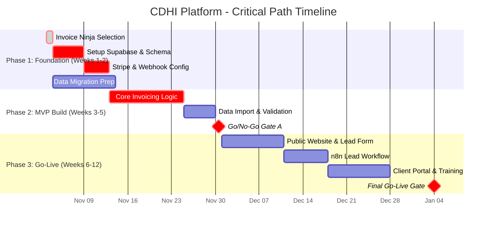

# Critical Path Map — CDHI Digital Platform (S2 MVP)

> **Purpose**: Track cross-layer impacts, risks, and dependencies for implementing a custom business platform. This S2-tier project will replace a $120/mo subscription, enhance lead generation, and streamline operations for a construction business.

---

## Project Context

### Decision Summary
**What are we doing?**  
Building a unified web platform with a public-facing marketing site, a client portal, and an admin dashboard for CRM, project management, invoicing, and automations.  
**Why are we doing it?**  
Save subscription costs, automate manual processes, and enhance brand credibility.  
**Success Criteria (Acceptance Gates)**  

- **Gate A (MVP Live, Week 5)**: Replace existing paid app, migrate initial data, send at least five invoices using the new platform.  
- **Gate B (Website Live, Week 8)**: Launch public marketing site with SEO optimization and lead form integrated with automation workflow.  
- **Gate C (Operational Readiness, Week 12)**: Ensure daily backups, monitoring alerts, and tested restore procedures; finalize training for your uncle and team.

---

## Cross-Layer Impact Analysis

| Decision | Impact on Application Layer (L6) | Impact on Security/Ops (L5) | Impact on Build/Deploy (L4) | Impact on Development (L3) | Impact on Data (L2) |
|---------|--------------------------------|-----------------------------|------------------------------|---------------------------|--------------------|
| **Invoice Ninja** | Provides client portal, quote→invoice flow, e-signatures, and time tracking. | Requires secure API keys and webhook signatures. | Install via Docker; maintain container updates. | Integrate via Laravel SDK or REST API. | Align Supabase schema to support clients, invoices, payments. |
| **Stripe** | Enables online payments through Invoice Ninja portal. | Use webhook secrets; adhere to PCI compliance. | Store keys in environment variables; test webhooks. | Implement idempotent webhook handlers; log events. | Ensure payments reconcile with invoices. |
| **Supabase** | Serves as backend database (BaaS) for storing clients, jobs, leads, invoices, etc. | Define Row Level Security policies and backups. | Manage DB migrations; use GitHub Actions for deployment. | Use typed APIs with validation. | Build canonical relational schema with foreign keys. |
| **n8n** | Automates lead intake, reminders, and status updates. | Secure token storage; handle retries and dead-letter queue logic. | Version workflows via Docker; integrate with Invoice Ninja and Stripe. | Use JavaScript code nodes for mapping. | Audit events and store workflow logs in Supabase. |

---

## Dependencies & Sequencing

---

## ⚠️ Risks & Mitigations

| Risk ID | Risk Description | Probability | Impact | Mitigation | Contingency |
|---------|-----------------|-------------|--------|-----------|-------------|
| **R1** | Data migration errors cause incorrect historical records. | Medium | High | Use provided CSV templates; perform a dry-run import into a staging environment. | Re-import targeted data sets; manually correct high-priority records. |
| **R2** | Payment webhook failures lead to unpaid invoices not being marked as paid. | Low | High | Thoroughly test in Stripe's sandbox; use webhook signature verification; log all events. | Manual reconciliation process; build an n8n workflow to replay failed events. |
| **R3** | Uncle has difficulty adopting the new system, increasing admin time. | Medium | Medium | Conduct two short training sessions; provide simple "cheatsheet" documents for common tasks. | Offer on-demand screen-sharing support sessions for the first month. |
| **R4** | Scope creep expands the project beyond the S2 tier and agreed price. | High | Medium | Use MoSCoW prioritization; require all new feature requests via a simple form. | Defer non-critical features to a "Phase 2" backlog to be priced separately. |
| **R5** | Outage or data loss due to infrastructure failure. | Low | High | Configure and verify daily automated backups in Supabase; implement basic uptime monitoring. | Follow documented restore procedure; communicate downtime to your uncle. |

---

## 🔗 Evidence & Artifacts

- **Decision Documentation**: ADR for using Supabase and Next.js.  
- **Design Docs**: `cdhi_supabase_schema.sql`, `cdhi_api_contract.postman_collection.json`, `cdhi_n8n_lead_flow.json`.  
- **Project Management**: Risk register (`cdhi_risk_register.csv`), backlog (`cdhi_backlog_mvp.csv`), RACI matrix (defined in project plan).  
- **Go-Live & Testing**: `cdhi_go_live_checklist.md`, `.env` template (`cdhi_env.example`).  
- **Local Downloads**: Artifact pack and CSV import templates.

---

## Operational SOPs (At-a-Glance)

- **Imports**: Follow CSV order: Clients → Properties → Leads → Estimates → Jobs → Invoices → Payments.
- **Payments**: Use Stripe hosted links; verify webhooks; log and replay failed events.
- **Backups**: Daily backups with 14-day retention; quarterly restore tests.
- **Monitoring**: Uptime and error alerts to email/SMS.
- **Change Requests**: Use MoSCoW prioritization; capture new feature requests via form; defer non-MVP features to Phase 2.

---

## Next Steps (Action Items)

1. **Confirm Invoicing App**: Invoice Ninja selected. Ensure compatibility with existing migration from previous app (unknown name yet).  
2. **Set Up Infrastructure**: Deploy Invoice Ninja via Docker; apply Supabase schema; configure Stripe keys in .env; test webhooks using Postman collection.  
3. **Data Migration & Workflow**: Prepare CSVs using templates; import them in the specified order; import n8n lead flow; integrate with Invoice Ninja and Twilio; extend automation for quotes and invoices.  
4. **Training & Adoption**: Schedule two training sessions; create cheat sheet; provide on-demand support for first month.  
5. **Commit to GitHub**: After review and confirmation, commit this file to `CS-Construction` repository.  

---

*Last updated: 2025-10-27*
