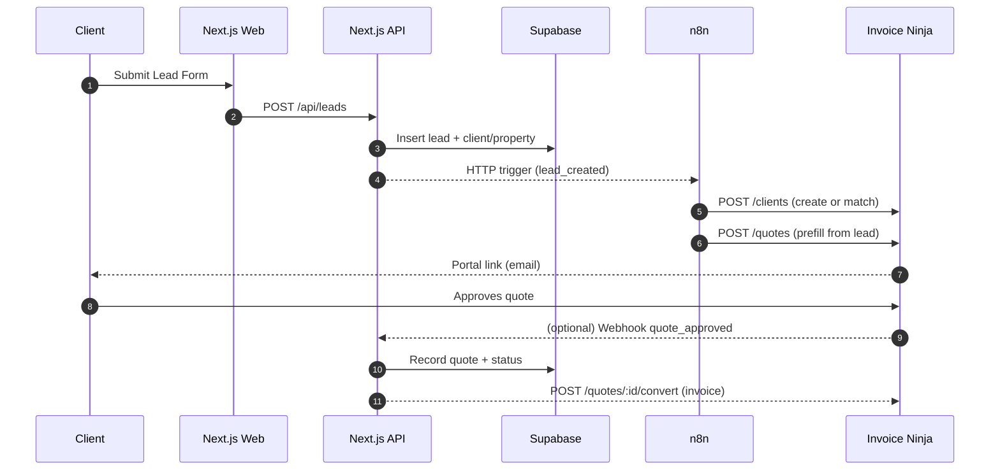
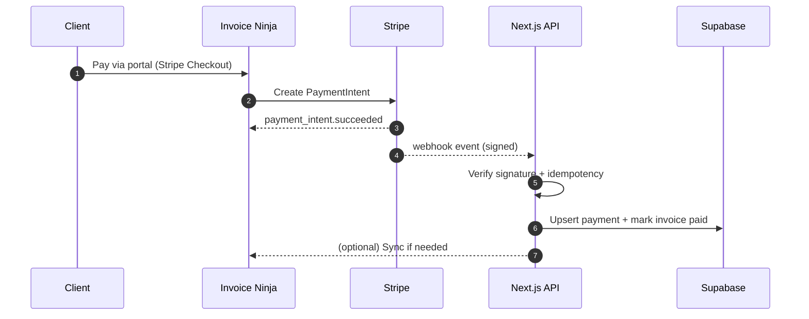
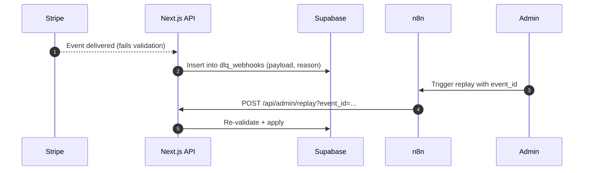

# CS-Construction / CDHI — Full System Architecture & Wiring
**Date:** October 27, 2025 (America/Chicago)  
**Owner:** David Ortiz (@davidinfosec07)

> This document explains *how every piece is wired together* for the S2 MVP and its Phase‑2 headroom. It covers the tech stack, network topology, data flows, integration points, security, CI/CD, observability, and recovery.

---

## 0) Stack Inventory (At‑a‑Glance)
- **Frontend:** Next.js (App Router), TypeScript, TailwindCSS
- **Backend/API:** Next.js API routes (server actions), Node 18+
- **Data Layer:** Supabase (Postgres + Storage)
- **Auth (Phase‑2 option):** Supabase Auth (JWT/RLS) for custom portal
- **Invoicing/Portal:** Invoice Ninja (self‑hosted via Docker)
- **Payments:** Stripe (Checkout + webhooks)
- **Automation/ETL:** n8n (Docker) for lead intake, reminders, event replay
- **Email:** Postmark or SendGrid (transactional)
- **SMS:** Twilio (optional notifications/scheduling)
- **Monitoring:** Uptime Kuma/Better Stack; Sentry (error tracking)
- **Reverse Proxy & TLS:** Caddy or Traefik (Docker), Let’s Encrypt
- **CI/CD:** GitHub Actions → Vercel (Next.js) + Docker host (n8n / Invoice Ninja)
- **Secrets:** Environment variables + Docker Secrets (for self‑hosted apps)
- **Source Control:** GitHub (repo: `CS-Construction`)
- **Issue Tracking:** GitHub Issues + `cdhi_backlog_mvp.csv` (importable)

> MVP leans on **Invoice Ninja’s client portal** for quotes/invoices/payments. **Phase‑2** can add a **custom Next.js client portal** backed by Supabase Auth while still using Invoice Ninja via API.

---

## 1) High‑Level Architecture
```mermaid
flowchart LR
  subgraph Client["Client Devices (Mobile/Desktop)"]
    Web[Public Website (Next.js)] -->|Lead Form| API[/Next.js API/]
    Portal[Invoice Ninja Client Portal]
  end

  API -->|CRUD| DB[(Supabase Postgres)]
  API -->|Files| Storage[(Supabase Storage)]
  API -->|Emit Events| N8N[n8n Automation]

  Portal -->|Stripe Checkout| Stripe[(Stripe PSP)]
  Web -->|Stripe link (optional)| Stripe

  Stripe -->|Webhooks| API
  Stripe -->|Webhooks| INinja[Invoice Ninja]

  N8N -->|HTTP| INinja
  INinja -->|Webhooks (optional)| API

  subgraph Infra["Self-Hosted on VPS"]
    INinja[Invoice Ninja (Docker)]
    N8N[n8n (Docker)]
    Proxy[Caddy/Traefik Reverse Proxy + TLS]
    Monitor[Uptime Kuma]
  end

  subgraph Cloud
    DB
    Storage
  end

  API -->|Email/SMS| Mail[Postmark/SendGrid] & Twilio[Twilio]
  Monitor -->|Health Checks| Web
  Monitor -->|Health Checks| INinja & N8N
```
**Hosting Model**
- **Next.js** → Vercel (or similar) for fast DX and edge caching.
- **Supabase** → Fully managed Postgres + Storage + (optional) Auth.
- **Invoice Ninja + n8n + Reverse Proxy + Uptime Kuma** → Single VPS (Docker Compose) with TLS via Let’s Encrypt.

---

## 2) Component Responsibilities & Wiring

### 2.1 Next.js (Web + API)
- **Web**: Marketing pages, SEO, lead form.
- **API routes**: `/api/leads`, `/api/webhooks/stripe`, `/api/webhooks/invoiceninja` (optional), `/api/admin/replay`.
- **Security**: Verify webhook signatures (Stripe), idempotency keys, request validation (Zod).
- **Outbound**: Supabase SDK for DB/Storage; HTTP to n8n; email via Postmark/SendGrid; SMS via Twilio.

### 2.2 Supabase (Postgres + Storage + Auth option)
- **Tables**: `clients`, `properties`, `leads`, `jobs`, `estimates`, `invoices`, `payments`, `change_orders`, mapping tables to external IDs.
- **Views**: `v_client_ar`, KPI views (lead→close %, DSO, overdue $, cycle time).
- **RLS (Phase‑2)**: Per‑client and per‑role access if building a custom portal.
- **Backups**: Daily automated with 14‑day retention (verify monthly).

### 2.3 Invoice Ninja (Docker)
- **Function**: Quotes, invoices, client portal, Stripe integration.
- **DB**: MariaDB/MySQL (default in official Docker images).
- **Inbound**: n8n creates/updates clients and quotes via REST.
- **Outbound**: Stripe payments; optional webhooks back to Next.js.
- **Security**: API token, admin over HTTPS only, reverse proxy with TLS; IP allowlist to admin routes (optional).

### 2.4 Stripe
- **Initiation**: From Invoice Ninja’s portal *or* from Next.js (hosted checkout link).
- **Webhooks**: Deliver to **both** Invoice Ninja and Next.js for redundancy.
- **Safety**: Signature verification; replay protection using event IDs; idempotent updates.

### 2.5 n8n (Automation)
- **Flows**: Lead intake → create Supabase records → create Invoice Ninja client/quote → notify user.
- **Utilities**: Reminder schedules; failed‑webhook DLQ; replay command endpoint.
- **Security**: Basic auth or JWT on inbound webhooks; secrets stored in n8n credentials; restrict public nodes.

### 2.6 Reverse Proxy & TLS (Caddy/Traefik)
- **Routes**:
  - `https://portal.cdhi.example` → Invoice Ninja
  - `https://automate.cdhi.example` → n8n
  - `https://status.cdhi.example` → Uptime Kuma
- **TLS**: Let’s Encrypt auto‑renewal.
- **Hardening**: Security headers; HTTP→HTTPS redirect; rate limiting (option).

### 2.7 Monitoring & Alerting
- **Uptime Kuma/Better Stack**: HTTP checks for Next.js, Invoice Ninja, n8n endpoints.
- **Sentry**: Client + server SDK for error reporting.
- **Stripe & n8n**: Alert on failed webhook delivery or node failures.
- **KPI dashboards**: SQL views in Supabase, optional Metabase/Chartbrew.

---

## 3) Environments & URLs
- **Local**: `http://localhost:3000` (Next.js), `http://localhost:8080` (n8n), `http://localhost:8443` (Invoice Ninja via proxy).
- **Staging**:
  - Next.js: `https://staging.cdhi.example`
  - Invoice Ninja: `https://portal-staging.cdhi.example`
  - n8n: `https://automate-staging.cdhi.example`
- **Production**:
  - Next.js: `https://cdhomeimprovementsrockford.com`
  - Invoice Ninja: `https://portal.cdhomeimprovementsrockford.com`
  - n8n: `https://automate.cdhomeimprovementsrockford.com`
- **DNS**: A/AAAA to VPS for self‑hosted; CNAME to Vercel for Next.js.

---

## 4) Data Model & External Mapping

### 4.1 Core Entities (Supabase)
- **clients**: name, email, phone, billing address; `invoiceninja_client_id`
- **properties**: link to client; address; geo; notes
- **leads**: source, intake_notes, budget_min/max, status
- **jobs**: phases, permit_number, attachments (Supabase Storage)
- **estimates**: linked to leads/jobs; `invoiceninja_quote_id`
- **invoices**: totals, due_date, status; `invoiceninja_invoice_id`
- **payments**: amount, method, status; `stripe_payment_intent_id`, `stripe_event_id`
- **change_orders**: description, approval status, signed_at

### 4.2 Mapping Tables (xref)
- `external_clients(client_id, invoiceninja_client_id)`
- `external_quotes(estimate_id, invoiceninja_quote_id)`
- `external_invoices(invoice_id, invoiceninja_invoice_id)`
- `external_payments(payment_id, stripe_payment_intent_id)`

> Use `UNIQUE` constraints to guarantee one‑to‑one mapping and enable idempotent upserts.

---

## 5) Critical Flows (Sequences)

### 5.1 Lead → Quote → Invoice


### 5.2 Payment Reconciliation


### 5.3 Failed Webhook Replay (DLQ)


---

## 6) API Surface (Selected)

**POST `/api/leads`**  
- Validates payload; inserts into Supabase; triggers n8n.  
- Returns `{ lead_id }`.

**POST `/api/webhooks/stripe`**  
- Verifies signature; upserts payment; idempotency by `stripe_event_id`.  
- Returns `200 OK`.

**POST `/api/webhooks/invoiceninja` (optional)**  
- Receives quote/invoice status changes; updates Supabase.  
- Auth via shared secret header.

**POST `/api/admin/replay`**  
- Secured (admin only). Replays DLQ events by `event_id`.

---

## 7) Security & Compliance

- **Transport**: HTTPS everywhere; HSTS; TLS 1.2+.
- **Webhooks**: Verify signatures (Stripe), shared secret (Invoice Ninja).
- **Idempotency**: Use unique keys (`stripe_event_id`, `invoice_ninja_event_id`).  
- **Auth (Phase‑2)**: Supabase Auth; Row Level Security on `clients`, `jobs`, `documents`.
- **Secrets**: `.env` + Docker Secrets; rotate Stripe/Invoice Ninja tokens quarterly.
- **Access Controls**: Admin panel behind SSO or IP allowlist; separate service accounts for n8n.
- **Backups**: Daily Supabase automated; weekly VPS snapshots; quarterly restore drill.
- **Logging**: Correlation‑ID per request; redact PII in logs.

---

## 8) Observability

- **Uptime**: Health checks for web, portal, n8n. Alert via email/SMS.
- **Errors**: Sentry DSN in Next.js (server+client) and n8n custom nodes.
- **Business KPIs**: SQL views; monthly report job in n8n (email summary).

---

## 9) CI/CD

**GitHub Actions**  
- **Next.js**: Lint → Test → Build → Deploy (Vercel).  
- **Supabase**: On PR merge, run `supabase db push` to staging; tag for production.  
- **Docker Stack**: Build images for Invoice Ninja and n8n; deploy via SSH to VPS.

**Release Strategy**  
- `main` → staging; tag `vX.Y.Z` → production with migration gate.  
- Automate DB migration run; auto‑rollback on failure (restore from snapshot).

---

## 10) Network & Ports

- **Proxy**: 80/443 open to internet; internal services bound to Docker network.  
- **Invoice Ninja**: internal port 9000; exposed via proxy `portal.*`.  
- **n8n**: internal port 5678; exposed via proxy `automate.*`.  
- **Uptime Kuma**: internal port 3001; exposed via proxy `status.*`.  
- **Firewall**: Deny all inbound except 80/443; allow egress to Stripe, email, SMS, Supabase.

---

## 11) Disaster Recovery (RTO/RPO)

- **RPO:** ≤ 24h (daily DB backups).  
- **RTO:** ≤ 4h (VPS snapshot restore + DNS TTL 300s).  
- **Runbook:** Documented restore steps for Supabase (point‑in‑time) and VPS snapshots; verify Invoice Ninja DB dumps weekly.

---

## 12) Configuration Inventory (env names)

- **Next.js**: `DATABASE_URL` (Supabase), `SUPABASE_ANON_KEY`, `STRIPE_SECRET_KEY`, `STRIPE_WEBHOOK_SECRET`, `N8N_WEBHOOK_URL`, `POSTMARK_TOKEN`/`SENDGRID_API_KEY`, `TWILIO_*`.
- **n8n**: `N8N_BASIC_AUTH_USER`, `N8N_BASIC_AUTH_PASSWORD`, credentials for Stripe, Supabase, Invoice Ninja.
- **Invoice Ninja**: `APP_URL`, `API_TOKEN`, DB creds, mail settings.
- **Proxy (Caddy/Traefik)**: DNS challenge or HTTP challenge keys; contact email.

---

## 13) Costs (estimates / month)
- **Domain**: ~$1 (annual ~$12).  
- **Supabase**: Free → $25 as usage grows.  
- **VPS**: $6–$12 (n8n + Invoice Ninja + proxy + uptime).  
- **Email/SMS**: Postmark/Twilio pay‑as‑you‑go.  
- **Sentry**: Free tier sufficient initially.

---

## 14) Roadmap & Gates (MVP → Phase‑2)

- **Gate A (MVP Live)**: Replace old app; quotes/invoices via portal; 5 invoices migrated; a client pays in portal.
- **Gate B (Website Live)**: SEO site + lead form; lead reaches Inbox + n8n within 60s.
- **Gate C (Ops Ready)**: Draw schedules; change orders; backups & monitoring verified.
- **Phase‑2**: Custom Next.js client portal with Supabase Auth + integrated ninja data.

---

## 15) Open Items / Decisions
- Email provider: Postmark vs SendGrid.
- Hosting: Vercel vs self‑hosted Next.js.
- Invoice Ninja webhook back to Next.js: enable vs rely solely on Stripe.
- Auth scope: stay with Ninja portal or build custom client portal (Phase‑2).

---

### Appendices

#### A) Example RLS (Phase‑2)
```sql
-- Example: clients visible only to their owner (user_id)
alter table clients enable row level security;
create policy "Own clients" on clients
  for select using (auth.uid() = owner_user_id);
```

#### B) Example Stripe Webhook (TypeScript)
```ts
import { NextRequest } from 'next/server';
import Stripe from 'stripe';

export async function POST(req: NextRequest) {
  const sig = req.headers.get('stripe-signature');
  const body = await req.text();
  const stripe = new Stripe(process.env.STRIPE_SECRET_KEY!, { apiVersion: '2023-10-16' });
  let event: Stripe.Event;

  try {
    event = stripe.webhooks.constructEvent(body, sig!, process.env.STRIPE_WEBHOOK_SECRET!);
  } catch (err) {
    return new Response('Invalid signature', { status: 400 });
  }

  // Idempotency: use event.id
  switch (event.type) {
    case 'payment_intent.succeeded':
      // upsert payment to Supabase here
      break;
  }

  return new Response('ok');
}
```

#### C) Docker Compose (IN + n8n + Proxy) — sketch
```yaml
version: '3.9'
services:
  proxy:
    image: caddy:latest
    ports: ['80:80', '443:443']
    volumes:
      - ./Caddyfile:/etc/caddy/Caddyfile
  invoiceninja:
    image: invoiceninja/invoiceninja:stable
    environment:
      - APP_URL=https://portal.cdhomeimprovementsrockford.com
      - DB_HOST=db
    depends_on: [db]
  db:
    image: mariadb:10.11
    environment:
      - MYSQL_ROOT_PASSWORD=strongpass
  n8n:
    image: n8nio/n8n:latest
    environment:
      - N8N_BASIC_AUTH_USER=admin
      - N8N_BASIC_AUTH_PASSWORD=pleasechange
```
---

**Note:** Some previously uploaded files in the chat may have expired. If you want me to re‑ingest `cdhi_supabase_schema.sql`, Postman collection, or n8n flow into this doc (or commit to GitHub), re‑upload them here and I’ll integrate them immediately.
